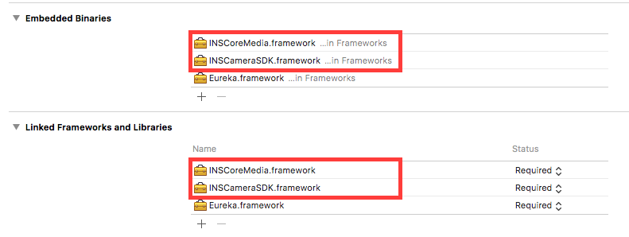
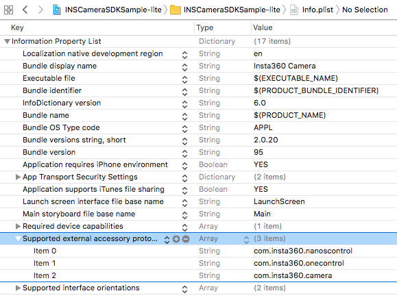
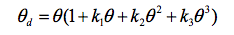
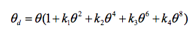

### 集成 INSCameraSDK

1. 将 INSCameraSDK and INSCoreMedia frameworks 加入到项目中


2. 在 Info.plist 中添加一项， Key 为 *Supported external accessory protocols*, 值为 `com.insta360.camera`(Nano), `com.insta360.onecontrol`(ONE),`com.insta360. onexcontrol `(ONE X）及 `com.insta360.nanoscontrol`(Nano S)


3. 在 AppDelegate 的 `didFinishLaunchingWithOptions` 或者其它要开始监听 Insta360 相机的地方调用 `[[INSCameraManager sharedManager] setup];` 启动SDK

```objc
// Objective-C
#import <INSCameraSDK/INSCameraSDK.h>

- (BOOL)application:(UIApplication *)application didFinishLaunchingWithOptions:(NSDictionary *)launchOptions {
    [[INSCameraManager sharedManager] setup];
    return YES;
}
```

``` swift
// Swift
import INSCameraSDK`

func application(_ application: UIApplication, didFinishLaunchingWithOptions launchOptions: [UIApplicationLaunchOptionsKey: Any]?) -> Bool {
    INSCameraManager.shared().setup()
    return true
    
}
```

4. 当你的app 不再需要使用insta360 相机时，调用 `[[INSCameraManager sharedManager] shutdown]` 来销毁资源。

### 监听 Insta360 Nano, ONE, Nano S, ONE X 的连接状态

- 你可以在 `[NSNotificationCenter defaultCenter]` 注册 `INSCameraDidConnectNotification` 和 `INSCameraDidDisconnectNotification` 的消息

- 或者使用 KVO 来监听 `[INSCameraManager SharedManager].cameraState` 值的变换。 一旦 cameraState 的值变为 `INSCameraStateConnected`, 你的 app 就能与相机进行交互了.

### 发送命令

建议在熟悉[`Open Spherical Camera API - Commands`](https://developers.google.cn/streetview/open-spherical-camera/guides/osc/commands/?hl=zh-cn)官方文档后，再进行OSC相关的后续开发。

相机网络地址为`http://192.168.42.1`，调用Open Sepherial Camera API执行命令[`/osc/commands/execute`](https://developers.google.cn/streetview/open-spherical-camera/guides/osc/commands/execute?hl=zh-cn)

针对命令的执行情况，需自行轮询调用[`/osc/commands/status`](https://developers.google.cn/streetview/open-spherical-camera/guides/osc/commands/status)获取相机对当前命令的执行状态。轮询周期可视具体情况调整。

相机支持除预览流外，[Open Spherical Camera API level 2](https://developers.google.com/streetview/open-spherical-camera/reference/?hl=zh-cn)的相关命令

#### 使用Lightning接口连接

当使用Lightning接口连接相机时，相机地址需改为`http://localhost:9099`

```Objective-C
#import <Foundation/Foundation.h>

NSDictionary *headers = @{ @"Content-Type": @"application/json",
                           @"X-XSRF-Protected": @"1",
                           @"Accept": @"application/json" };
NSDictionary *parameters = @{ @"name": @"camera.takePicture" };

NSData *postData = [NSJSONSerialization dataWithJSONObject:parameters options:0 error:nil];

NSURL *url = [NSURL URLWithString:@"http://localhost:9099/osc/commands/execute"];
NSMutableURLRequest *request = [NSMutableURLRequest requestWithURL:url
                                                       cachePolicy:NSURLRequestUseProtocolCachePolicy
                                                   timeoutInterval:10.0];
[request setHTTPMethod:@"POST"];
[request setAllHTTPHeaderFields:headers];
[request setHTTPBody:postData];

NSURLSession *session = [NSURLSession sharedSession];
[[session dataTaskWithRequest:[[NSURLRequest alloc] init]
            completionHandler:^(NSData *data, NSURLResponse *response, NSError *error) {
    if (error) {
        NSLog(@"%@", error);
    } else {
        NSHTTPURLResponse *httpResponse = (NSHTTPURLResponse *) response;
        NSLog(@"%@", httpResponse);
    }
}] resume];
```

#### 拍照&录像

* 参考Google的Open Spherical Camera API[`camera.takePicture`](https://developers.google.com/streetview/open-spherical-camera/reference/camera/takepicture?hl=zh-cn)进行拍照
* 参考Google的Open Spherical Camera API[`camera.startCapture`](https://developers.google.com/streetview/open-spherical-camera/reference/camera/startcapture?hl=zh-cn)开始录像
* 参考Google的Open Spherical Camera API[`camera.stopCapture `](https://developers.google.com/streetview/open-spherical-camera/reference/camera/stopcapture?hl=zh-cn)停止录像


#### 拍摄参数

* 参考Google的Open Spherical Camera API[`camera.setOptions`](https://developers.google.com/streetview/open-spherical-camera/reference/camera/setoptions?hl=zh-cn)设置相机相关参数
* 参考Google的Open Spherical Camera API[`camera.getOptions`](https://developers.google.com/streetview/open-spherical-camera/reference/camera/getoptions?hl=zh-cn)获取相机相关参数
* 相机相关参数参考[Open Spherical Camera API参数说明](https://developers.google.com/streetview/open-spherical-camera/reference/options?hl=zh-cn)

#### 获取文件

参考Google的Open Spherical Camera API[`camera.listFiles`](https://developers.google.com/streetview/open-spherical-camera/reference/camera/listfiles?hl=zh-cn)获取文件相关信息列表

### 相机状态及其他信息

#### 1. INSCameraSDK

App 不仅可以向相机发送指令，还可以接收相机发过来的通知。 比如电量的变化。所有的消息都列在了 `NSNotification+INSCamera.h` 头文件中。
注意，所有的此类消息会由 `INSCameraManager.sharedManager.notificationCenter` 来发送，而不是 `NSNotificatoinCenter.defaultCenter`.

```swift
override func viewDidLoad() {
    super.viewDidLoad()
    INSCameraManager.shared().notificationCenter.addObserver(self, selector: #selector(handleNotification), name: .INSCameraBatteryStatus, object: nil)
}

func handleNotification(notification: NSNotification) {
    print("receive notification \(notification.name), info: \(String(describing: notification.userInfo))");
    guard let storageStatus = notification.userInfo as? INSCameraBatteryStatus else {
        return
    }

    var msg: String
    switch storageStatus.powerType {
        case .adapter:
            msg = "charging"
        case .battery:
            msg = "left percentage \(Double(batteryLevel) / Double(batteryScale))"
    }
    print("battery status \(msg)")
}
```

#### 2. Open Spherical Camera API

建议在熟悉[`Open Spherical Camera API`](https://developers.google.cn/streetview/open-spherical-camera/guides/osc/?hl=zh-cn)官方文档后，再进行OSC相关的后续开发。

* 参考Google的Open Spherical Camera API[`/osc/info`](https://developers.google.cn/streetview/open-spherical-camera/guides/osc/info?hl=zh-cn)获取相机相关信息
* 参考Google的Open Spherical Camera API[`/osc/state`](https://developers.google.cn/streetview/open-spherical-camera/guides/osc/state?hl=zh-cn)获取相机当前状态

### 处理音视频数据

#### 控制中心 - `INSCameraMediaSession`

`INSCameraMediaSession` 是INSCameraSDK 处理音视频数据的核心类. 它有以下功能:

1. 通过设置 `expectedAudioSampleRate`, `expectedVideoResolution` 和 `gyroPlayMode` 来配置相机传到手机的参数.
2. 控制相机音视频流的开关, 调用 `startRunningWithCompletion:` 来开启,  `stopRunningWithCompletion:` 来关闭.
3. 解析并对相应数据进行解码和对图像进行拼接.
4. 将数据分发到 `INSCameraMediaPluggable` 中，比如 `INSCameraPreviewPlayer`、`INSCameraFlatPanoOutput`.
5. 当 session 已经打开时, 你同样可以配置相机的参数，接入或断开 `INSCameraMediaPluggable`, 但需要调用 `commitChangesWithCompletion:` 来使其生效.

#### 预览代码

```swift
import UIKit
import INSCoreMedia
import INSCameraSDK

class PreviewViewController: UIViewController, INSCameraVideoDataDelegate {
    let mediaSession = INSCameraMediaSession()
    var previewPlayer: INSCameraPreviewPlayer!

    deinit {
        mediaSession.unplug(previewPlayer)
        mediaSession.stopRunning { (err) in
            print("stop media session with err: \(String(describing: err))")
        }
    }

    override func viewDidLoad() {
        super.viewDidLoad()

        previewPlayer = INSCameraPreviewPlayer(frame: self.bounds, renderType: .sphericalPanoRender)
        self.view.addSubview(previewPlayer.renderView)
        previewPlayer?.renderView.enableGyroStabilizer = true

        mediaSession.plug(previewPlayer)
        mediaSession.expectedVideoResolution = INSVideoResolution2560x1280x30;
        mediaSession.startRunning { (err) in
            print("start running media session with error: \(String(describing: err))")
        }
    }
}
```
### 拼接&HDR

#### 缩略图

通过`INSImageInfoParser`从文件尾中获取预存在文件中的缩略图数据（缩略图为1920 * 960），然后通过`INSFlatPanoOffscreenRender`进行缩略图拼接。

通过`INSFlatPanoOffscreenRender(renderWidth: height:)`获取缩略图拼接对象，并配置缩略图拼接导出所需的分辨率

```swift
guard let path: String = Bundle.main.path(forResource: "IMG_20181029_182547_00_295", ofType: "insp") else {
    print("Render: file not found")
    return
}
let url: URL = URL(fileURLWithPath: path)
let parser: INSImageInfoParser = INSImageInfoParser(url: url)
if parser.open() {
    guard let data = parser.extraInfo?.thumbnail else {
        print("Render: no thumbnail")
        return
    }
    guard let thumbnail = UIImage(data: data) else {
        print("Render: generate image failed")
        return
    }
}
```

#### 拼接

使用`INSImageInfoParser`从文件尾中获取offset以及陀螺仪数据等相关信息。

使用`INSFlatPanoOffscreenRender`将insp拼接合成为2：1的图片。（P.s. `INSFlatPanoOffscreenRender`中的`offset`不可为空，否则无法正常拼接图片）

```swift 
guard let path: String = Bundle.main.path(forResource: "IMG_20181029_182547_00_295", ofType: "insp") else {
    return
}
guard let origin = UIImage(contentsOfFile: path) else {
    return
}
let url: URL = URL(fileURLWithPath: path)
let parser: INSImageInfoParser = INSImageInfoParser(url: url)
guard parser.open(), let extraInfo: INSExtraInfo = parser.extraInfo, let size = extraInfo.metadata?.dimension else {
    return
}

let render: INSFlatPanoOffscreenRender = INSFlatPanoOffscreenRender(renderWidth: Int32(size.width), height: Int32(size.height))
render.eulerAdjust = extraInfo.metadata?.euler
render.offset = extraInfo.metadata?.offset
if let gyroData = extraInfo.gyroData, let gyroPlayer = INSGyroPBPlayer(pbGyroData: gyroData) {
    let orientation = gyroPlayer.getImageOrientation(with: INSRenderType.flatPanoRender)
    render.gyroStabilityOrientation = orientation
}
else {
    render.gyroStabilityOrientation = GLKQuaternionIdentity
}
render.setRenderImage(origin)
let result: UIImage? = render.renderToImage()
```

#### HDR合成

使用`INSHDRTask`进行HDR图片合成。HDR合成耗时较长，大约需要5-10秒。

传入`INSHDROptions`的urls为有序数组，数组顺序需为 [ ev0, -ev, +ev ]。通过ONE X拍摄的照片，文件名默认升序即为 [ ev0, -ev, +ev ]。

```swift
let names: [String] = ["IMG_20181029_182547_00_295", "IMG_20181029_182547_00_296", "IMG_20181029_182547_00_297"]
var urls: [URL] = [URL]()
for name in names {
    let path: String = Bundle.main.path(forResource: name, ofType: "insp")!
    let url: URL = URL(fileURLWithPath: path)
    urls.append(url)
}
let options: INSHDROptions = INSHDROptions()
options.urls = urls
options.seamlessType = INSSeamlessType.opticalFlow

let commandManager = INSCameraManager.shared().commandManager
let task: INSHDRTask = INSHDRTask(commandManager: commandManager)
task.process(with: options, completion: { (err, data) in
    if let err = err {
        return
    }
    
    // do anything with the stitched image here, for example, display it
    if let hdrData = data, let hdrImage = UIImage(data: hdrData) {
        self?.displayImage(hdrImage, duration: 5)
    }
})
```

HDR合成算法库分以下两种，ONE X推荐使用`INSHDRLibInsImgProc`

```objc
typedef NS_ENUM(NSUInteger, INSHDRLib) {
    /// using `OpenCV` to generate hdr image
    INSHDRLibOpenCV,
    
    /// using `InsImgProLib` to generate hdr image
    INSHDRLibInsImgProc,
};
```

HDR合成过程中对以下两种拼接算法进行了封装：

```objc
typedef NS_ENUM(NSUInteger, INSSeamlessType) {
    /// default type
    INSSeamlessTypeTemplate,
    
    /// using Optical flow
    INSSeamlessTypeOpticalFlow,
};
```

### 陀螺仪数据 - `INSMediaGyro`

* 假如只有文件路径时，可通过`INSImageInfoParser`获取`INSMediaGyro`从而获得`ax, ay, az, gx, gy, gz`等相关数据

```swift
guard let path: String = Bundle.main.path(forResource: "IMG_20181029_182547_00_295", ofType: "insp") else {
    print("Render: file not found")
    return
}
let url: URL = URL(fileURLWithPath: path)
let parser: INSImageInfoParser = INSImageInfoParser(url: url)
if parser.open() {
	let gyro = parser?.gyroData
	print("ax: \(gyro?.ax), ay: \(gyro?.ay), az: \(gyro?.az), gx: \(gyro?.gx), gy: \(gyro?.gy), gz: \(gyro?.gz)")
}
```

* 假如持有`INSExtraInfo`对象，可直接获取`INSMediaGyro`（P.s. `INSExtraInfo`可通过`INSImageInfoParser`获取）

```swift
let gyro = extraInfo.metadata?.gyro
print("ax: \(gyro?.ax), ay: \(gyro?.ay), az: \(gyro?.az), gx: \(gyro?.gx), gy: \(gyro?.gy), gz: \(gyro?.gz)")
```

#### 图片陀螺仪矫正

可通过`INSFlatGyroAdjustOffscreenRender`对已完成拼接的平面2:1图片进行陀螺仪矫正：

```swift 
guard let path: String = Bundle.main.path(forResource: "IMG_20181029_182547_00_295", ofType: "insp") else {
    return
}
guard let origin = UIImage(contentsOfFile: path) else {
    return
}
let url: URL = URL(fileURLWithPath: path)
let parser: INSImageInfoParser = INSImageInfoParser(url: url)
guard parser.open(), let extraInfo: INSExtraInfo = parser.extraInfo, let size = extraInfo.metadata?.dimension else {
    return
}

let render: INSFlatGyroAdjustOffscreenRender = INSFlatGyroAdjustOffscreenRender(renderWidth: Int32(size.width), height: Int32(size.height))
render.eulerAdjust = extraInfo.metadata?.euler
render.offset = extraInfo.metadata?.offset
if let gyroData = extraInfo.gyroData, let gyroPlayer = INSGyroPBPlayer(pbGyroData: gyroData) {
    let orientation = gyroPlayer.getImageOrientation(with: INSRenderType.flatPanoRender)
    render.gyroStabilityOrientation = orientation
}
else {
    render.gyroStabilityOrientation = GLKQuaternionIdentity
}
render.setRenderImage(origin)
let result: UIImage? = render.renderToImage()
```

### 内部参数

* Insta360 fisheye distortion:



* Opencv fisheye distortion:



可通过`INSOffsetParser`获取`INSOffsetParameter`内部参数

```swift
guard let path: String = Bundle.main.path(forResource: "IMG_20181029_182547_00_295", ofType: "jpg") else {
    print("file not found")
    return
}
let imageParser = INSImageInfoParser(url: URL(fileURLWithPath: path))
let image = UIImage(contentsOfFile: path)
if imageParser.open(), let offset = imageParser.offset {
    let offsetParser = INSOffsetParser(offset: offset, width: Int32(image!.size.width), height: Int32(image!.size.height))
    if let parameters = offsetParser.parameters {
        for param in parameters {
            print("Internal parameters: \(param)")
        }
    }
}
```

### 具体使用见头文件的备注和sample 项目